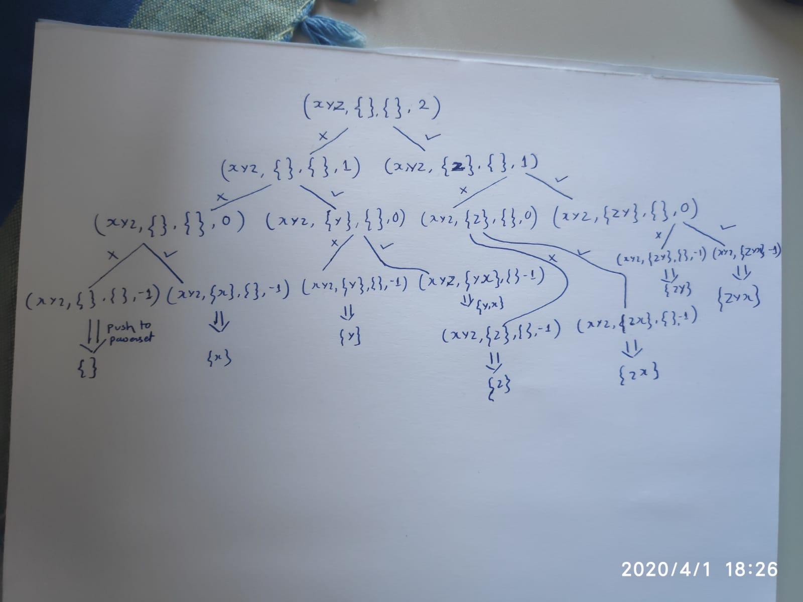

# Understanding SubArray, SubSequence and SubSet

## SubArray:
A sub-Array is a contigeous slice of the orginal array.

```
Let A = [1,2,3].

Then the valid sub-arrays are:
[1], [2], [3], [1,2], [2,3] and [1,2,3].

Notice that each valid sub-array is a contigeous slice of the orginal array.

No of sub-array for an array with 'N' elements: (N(N+1))/2
```

```C++
void generate_all_subarrays(vector<int> *array, vector<vector<int>> *subarrays)
{
	int size = 0; // Define the size of the subarray.
	while(size < array->size()) // Generate sub-arrays from size 0 to n-1.
	{
	    int start = 0; // Set the start point of the sub-array to first element
		for(; start < array->size(); start++) // Make sure that each element has a chance to be the start of the sub-array.
		{
			int end = start + size; // Calcultae the end point of the sub-array.
			if(end < array->size()) // If the end point is inside the array bounds then it is a valid sub-array.
			{
				vector<int> subarray;
				for(int i = start; i <= end; i++) // Copy the valid sub-array.
				{
					subarray.push_back(array->at(i));
				}
				subarrays->push_back(subarray); // Push this sub-array onto the set of all sub-arrays generated.
			}
		}
		size++; // Now increase the size of the sub-array being generated.
	}
}
```
---
## SubString == SubArray
A Sub-String is a contigeous slice of the original string.

It is the same as the sub-array in the context of a string.
```
Let s = 'abc'

Then its valid substrings are:
['a', 'b', 'c', 'ab', 'bc', 'abc']

Notice that each valid sub-string is a contigeous slice of the orginal string.

No of sub-strings for a string with 'N' elements: (N(N+1))/2

```

```C++
// The same logic as sub-array generation.
void generate_all_substrings(string *str, vector<string> *substrings)
{
	int size = 0;
	while(size < str->size())
	{
		int start = 0;
		for(; start < str->size(); start++)
		{
			int end = start + size;
			if(end < str->size())
			{
				string substring;
				for(int i = start; i <= end; i++)
				{
					substring += str->at(i);
				}
				substrings->push_back(substring);
			}
		}
		size++;
	}
}
```
---
## SubSequence
A sub-sequence is a slice of the original sequence such that the relative odering of the elements is maintained.

When a sub-sequence is contigeous in nature then it is called a sub-array.
```
Let A = [1,2,3].

Then a = [1,3] is a sub-sequence but not a sub-array.
But b = [1,2] is a sub-sequence and also a sub-array.

No of sub-sequences for a string/array with N elements: 2^n.
```
**NOTE AND DIGEST that the idea of generating all the sub-sequences of an array/string is == Generating the power-set of an array/string.**

---

## How to generate the power-set of an array/string?

### **Approach 1: Recursion**
The idea is similar to the 0/1 knapsack problem.

For each element in the set we have 2 options to evaluate.
1. Include the element in the powerset.
2. Exclude the element from the powerset.

This question teaches us the power of recursion and is very insightful.

So we take a string/array of size n and for its last element we ask:
1. Lets include it in the set and go on.
2. Lets exclude it from the set and go on.

**These questions are then asked recursivly on the string from size n-1 till 0.**

and when hit the base condition of empty string we push the set into the powerset.

```
The recurrence relation of this reccursive program is:
T(n) = 2T(n-1) + c.

Resulting in a time complexity of O(2^n).
```

The recursion tree of the function is given below:



What are the variables the function takes?
1. str = the original string whoes power set is being generated.
2. set = a set that is generated at the end of the recursion.
3. powerset = the set of all sets, the vector that holds the resultant poerset.
4. n = the cuurent character in the string we are considering.

```C++
void generate_power_set(string str, string set, vector<string> *powerset, int n)
{
	// If we reach a point where there are no more characters in the string to consider then we add the generated set to the powerset and exit the recursion.
	if(n < 0) powerset->push_back(set);
	else
	{
		// Lets Exclude the last character and go on.
		generate_power_set(str,set,powerset,n-1);
		// Lets Include the last character and go on.
		generate_power_set(str,set+=str.at(n),powerset,n-1);
	}
}

// Time Complexity: O(2^n).
// Space Complexity: O(n) or maybe O(n^2) if you assume that the average size of the 'set' string is n/2 at each function call.
```
---
### **Approach 2: Bit Operation Magic**

This ideea is based on the fact that the binary repersenttaion of numbers from 0 to 2^n - 1 give us all the sub-sequences possible. So if we mask the string with these binary numbers we get all the sub-sequnces of the string.
```
Set  = [a,b,c]
power_set_size = pow(2, 3) = 8
Run for binary counter = 000 to 111

Value of Counter            Subset
0    000                    -> Empty set
1    001                    -> a
2    010                    -> b
3    011                    -> ab
4    100                    -> c
5    101                    -> ac
6    110                    -> bc
7    111                    -> abc
```

```C++
void generate_all_subsequences(string str, vector<string> *sub_sequences)
{
	for(int i = 0; i < pow(2,str.size()); i++)
	{
		string sub_sequence ="";
		for(int j = 0; j < str.size(); j++)
		{
			if(i&(1<<j)) sub_sequence += str[j];
		}
		sub_sequences->push_back(sub_sequence);
	}
}
// Time: O(n2^n) : Outer loops runs 2^n times. Inner loop will run n times for each outer loop run, So total of n2^n runs.
// Space:
```
---

### **Approach 3: Iterative Approach **


---