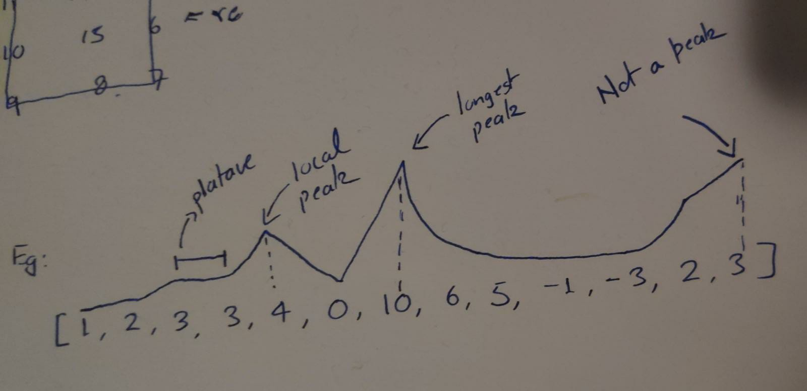

# Longest Peak


  Write a function that takes in an array of integers and returns the length of
  the longest peak in the array.

  A peak is defined as adjacent integers in the array that are strictly
  increasing until they reach a tip (the highest value in the peak), at which
  point they become strictly decreasing. At least three integers are required to form a peak.

  For example the integers __[1, 4, 10, 2]__ form a peak but the integers __[4, 0, 10]__ don't and neither do the integers __[1, 2, 2, 0]__. Similarly, the intergers __[1, 2, 3]__ don't form a peak because there aren't any strictly decreasing integrs after the 3.

  **IN SIMPLE WORDS we are tryint to achive what is shown in the image below**

  

## Best Idea

The problem of finding the longest peak can be broken down into two sub-problems
1. Find a peak.
2. Explore the peak to see how long it is.

Then return the longest peak you found.

Process to achive step 1:
1. Every peak in an array has the characteristic feature: If 'i' is the peak then array (i-1) < array (i) and array(i) > array (i+1).
2. So traverse the array and find all the indices that staisfy the above property. Such indices are peaks.
3. Exploring such peaks to find the how long they are is the next problem.

Process to achive step 2:
1. Explore the left side of the peek by making sure the property: array(l) > array(l-1) holds for each l, Keep decrementing l till the property holds. Then l will give the left extremity of the peak.
2. Explore the right side of the peek by making sure the property: array(r) > array (r+1) holds for each r, Keep incrementing r till the property holds. Then r will give the right extremity of the peak.
3. return r - l + 1 as the size of the peak we just explored.
4. If the r - l + 1 > max_peak then make r - l + 1 the max_peak.

```C++
// Time: O(N)
// Space: O(1)
using namespace std;

void explore_peak(vector<int> array, int index, int *max_peak)
{
	int i = index - 1;
	// Explore left slope
	while(i >= 0)
	{
	if(array[i+1] > array[i]) i--;
	else break;
	}
	i++;
	// Explore the right slope
	int j = index + 1;
	while(j < array.size())
	{
		if(array[j-1] > array[j]) j++;
		else break;
	}
	j--;
	if(j-i+1 > *max_peak) *max_peak = j-i+1;
}


int longestPeak(vector<int> array) {
if(array.size() == 0 || array.size() == 1 || array.size() == 2) return 0;
	int max_peak = 0;
  for(int i = 1; i < array.size() - 1; i++)
	{
		if(array[i-1] < array[i] && array[i] > array[i+1])
		{
			explore_peak(array,i,&max_peak);
		}
	}
	cout<<max_peak<<endl;
  return max_peak;
}

```