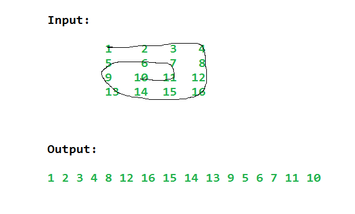

# Spiral Traverse

Write a function that takes in an n x m two-dimensional array (that can be square-shaped when n === m) and returns a one-dimensional array of all the array's elements in spiral order.

Spiral order starts at the top left corner of the two-dimensional array, goes to the right, and proceeds in a spiral pattern all the way until every element has been visited.

```
Input:
arrat = [
    [1, 2, 3, 4],
    [12, 13, 14, 5],
    [11, 16, 15, 6],
    [10, 9, 8, 7],
]

Output: [1, 2, 3, 4, 5, 6, 7, 8, 9, 10, 11, 12, 13, 14, 15, 16]
```
## Image of the Traversal


## The Logic:
The spiral traverse of a matrix can be broken down into recursive perimeter traversals.

1. Traverse the outer perimeter of the large matrix.
2. Now reduce the row_start, row_end, col_start and col_end bounds and repeat 1.

## A Very Important point to notice in the above logic
```
The L-R and R-L loop can overlap.
Similarly the T-D and D-T loops can overlap.
Notice the L-R and R-L overlap in the case below.
{1, 2, 3},
{8, 9, 4},
{7, 6, 5}

The if statements in the R-L loop and D-T loop are to prevent reprinting of 9.
Notice that L-R loop will print 9. So R-L should not print.

CONCLUSION: R-L | L-R overlapping occus when row_start == row_end

Simillarly,
{1, 2, 3},
{12, 13, 4},
{11, 14, 5},
{10, 15, 6},
{9, 8, 7},

The if statement in the D-T loop prevents the reprinting of 13,14,15.
Notice that the L-R and T-D loop will print 13,14,15.
So the other reverse loop should not run.

CONCLUSION: T-D | D-T overlapping occus when col_start == col_end
```
## Reccursive Approach

```C++
// Time: O(N) and Space of O(N)
using namespace std;

void spiral(vector<vector<int>> array, vector<int> *order, int row_start, int row_end, int col_start, int col_end)
{
		// Traverse the first row L-R
		for(int i = col_start; i <= col_end; i++)
		{
			order->push_back(array[row_start][i]);
		}
		// Travserse the last column T-D
		for(int i = row_start+1; i <= row_end; i++)
		{
			order->push_back(array[i][col_end]);
		}
		// Traverse the last row R-L
		for(int i = col_end-1; i >= col_start; i--)
		{
			if(row_start == row_end) break;
			order->push_back(array[row_end][i]);
		}
		// Traverse the first col D-T.
		for(int i = row_end-1; i > row_start; i--)
		{
			if(col_start == col_end) break;
			order->push_back(array[i][col_start]);
		}
}

vector<int> spiralTraverse(vector<vector<int>> array) {
	int row_start = 0;
	int row_end = array.size() - 1;
	int col_start = 0;
	int col_end = array[0].size() - 1;
	vector<int> order;
	
	while(row_start <= row_end && col_start <= col_end)
	{
		spiral(array,&order,row_start++,row_end--,col_start++,col_end--);
	}
  return order;
}
}
```